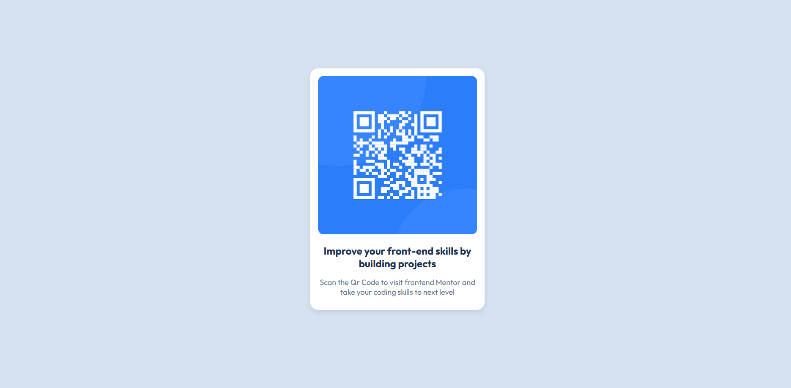

# Frontend Mentor - QR code component solution

This is a solution to the [QR code component challenge on Frontend Mentor](https://www.frontendmentor.io/challenges/qr-code-component-iux_sIO_H). Frontend Mentor challenges help you improve your coding skills by building realistic projects.

## Table of contents

  - I created a qr code component it basically shows a qr code component in the center of the screen this was a challenge by frontend mentor and I tried to replicate it on my own 

  - 

  - I built this width Html and CSS only
  - I learned how to use flexbox accurately and seamlessly applying it on the div although i faced problems as i am just a beginner and never had a hands on practice always use to watch tutorials but i took help of chatgpt and tried to built this on my own
