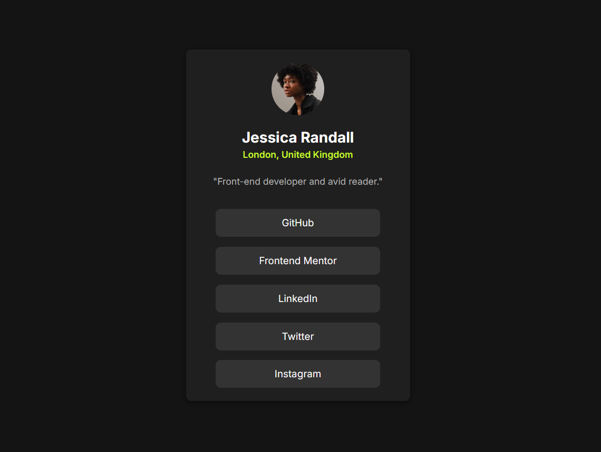
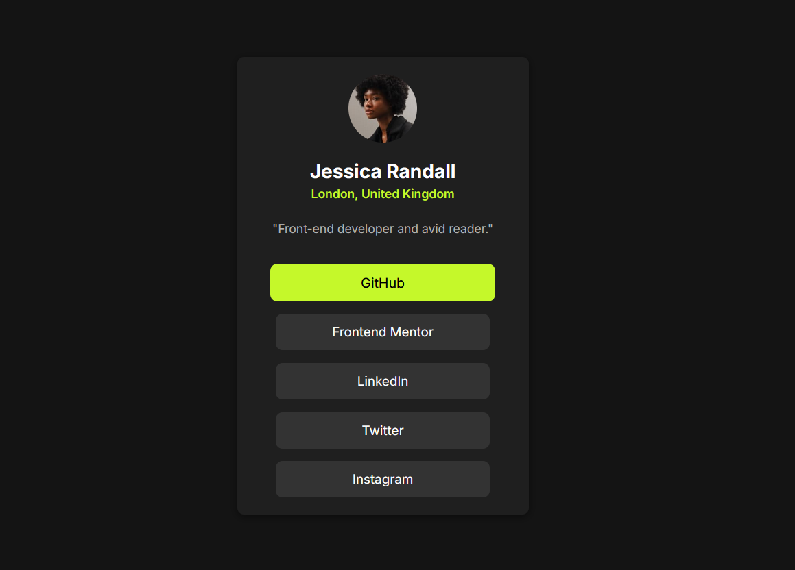

# Frontend Mentor - Social Links Profile Solution

This is my solution to the [Social Links Profile challenge on Frontend Mentor](https://www.frontendmentor.io/challenges/social-links-profile-UG32l9m6dQ).  
Frontend Mentor challenges help you improve your coding skills by building realistic, responsive projects.

---

## Table of Contents

- [Overview](#overview)
  - [The Challenge](#the-challenge)
  - [Screenshot](#screenshot)
  - [Links](#links)
- [My Process](#my-process)
  - [Built With](#built-with)
  - [What I Learned](#what-i-learned)
  - [Continued Development](#continued-development)
  - [Useful Resources](#useful-resources)
- [Author](#author)

---

## Overview

### The Challenge

Users should be able to:

- View the optimal layout for the site depending on their device’s screen size
- See hover and focus states for all interactive elements

---

### Screenshot




---

### Links

- **Solution URL:** [Add your Frontend Mentor solution link here](#)
- **Live Site URL:** [Add your live site link here](#)

---

## My Process

### Built With

- Semantic **HTML5** markup
- **CSS3** custom properties
- **Flexbox** for layout
- **Mobile-first** workflow
- **Responsive design** principles
- [Google Fonts - Inter](https://fonts.google.com/specimen/Inter)

---

### What I Learned

This challenge helped me focus on creating clean and minimal UI using just HTML and CSS.  
Some key learnings include:

- Structuring layouts using Flexbox effectively
- Maintaining consistent spacing and color hierarchy
- Designing interactive hover states with smooth transitions

Here’s a snippet of my favorite CSS from this project:

```css
.social-links a:hover {
  background-color: hsl(75, 94%, 57%);
  color: hsl(0, 0%, 8%);
  transform: scale(1.05);
  transition: all 0.3s ease;
}
```

### Continued Development

Going forward, I want to:
- Rebuild this project using React to practice component-based structuring
- Integrate accessibility improvements (like ARIA labels and keyboard navigation)
- Experiment with Tailwind CSS to replicate the same design faster

### Useful Resources

- [MDN Web Docs](https://developer.mozilla.org/en-US/) – For clear CSS and HTML documentation
- [CSS Tricks](https://css-tricks.com/) – Helped refine hover states and transitions
- [Frontend Mentor Community](https://www.frontendmentor.io/community) – For insights and inspiration from other developers

## Author

- Frontend Mentor – [@Srujan-Jangam](https://www.frontendmentor.io/profile/Srujan-Jangam)
- GitHub – [@Srujan-Jangam](https://github.com/Srujan-Jangam)
- Twitter – [@Srujan_Jangam](https://twitter.com/Srujan_Jangam)
