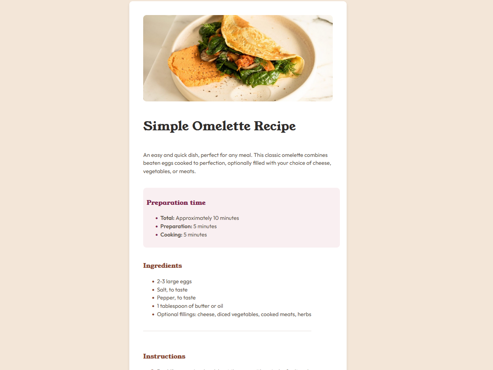
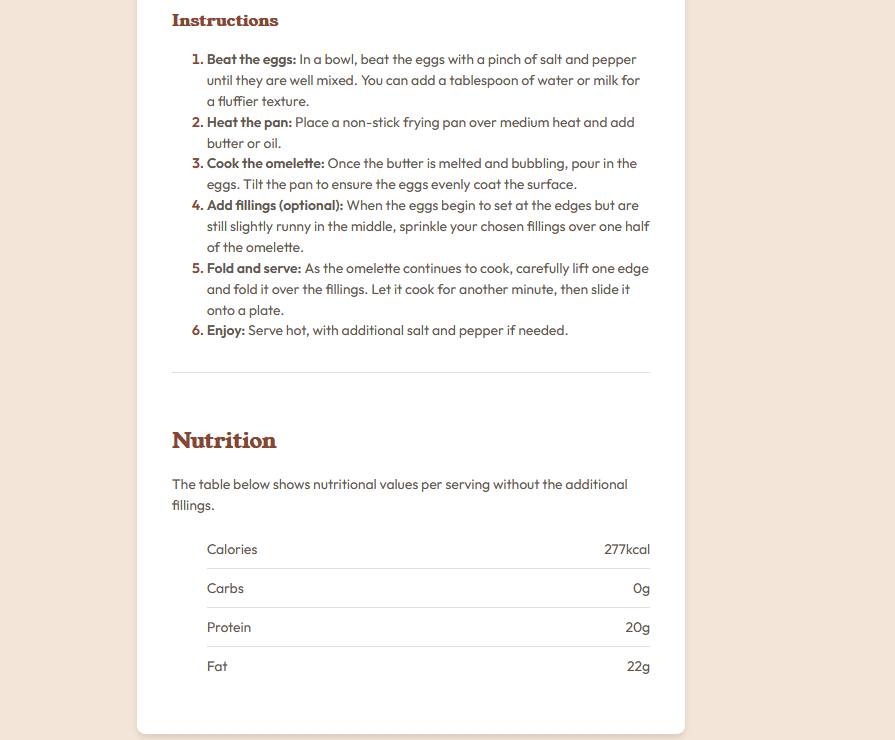

# Frontend Mentor - Recipe page solution

This is a solution to the [Recipe page challenge on Frontend Mentor](https://www.frontendmentor.io/challenges/recipe-page-KiTsR8QQKm). Frontend Mentor challenges help you improve your coding skills by building realistic projects.

## Overview

### The challenge
The challenge was to replicate a design of a recioe page which was to be done by using html and css only 

### Screenshot




### Links
- Solution URL: [https://www.frontendmentor.io/solutions/recipe-page-main-Cg4nxLwbxf]
- Live Site URL: [https://recipe-page-smoky-three.vercel.app/]

## My Process

### Built With
- Semantic HTML5
- CSS (Flexbox + basic styling)

### What I learned

I improved my skills in:

- Using semantic tags for better accessibility
- Fine-tuning typography and spacing to match a design
- Customizing list markers with CSS

Snippet I’m proud of:

```css
ol li::marker {
  color: hsl(14, 45%, 36%);
  font-weight: bold;
}
```

## Author
- Frontend Mentor – [@Srujan-Jangam](https://www.frontendmentor.io/profile/Srujan-Jangam)
- GitHub – [@Srujan-Jangam](https://github.com/Srujan-Jangam)
- Twitter – [@Srujan_Jangam](https://twitter.com/Srujan_Jangam)
